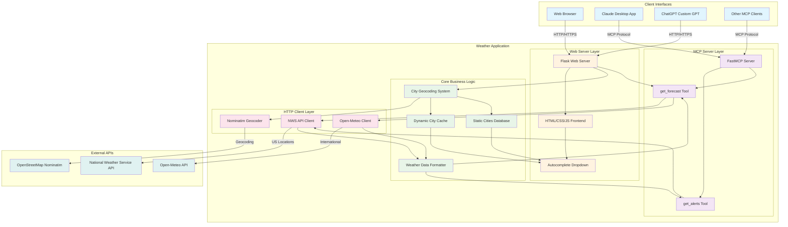

# Weather MCP Server - Complete Architecture

## Overview

A dual-interface weather application providing **worldwide weather forecasts** and **US weather alerts** through both a web GUI and MCP (Model Context Protocol) server interface.

## Architecture Diagram



## Component Details

### 1. Web Server Layer (`web_server.py`)

**Flask Application** providing HTTP endpoints:

#### API Endpoints

| Endpoint | Method | Description |
|----------|--------|-------------|
| `/` | GET | Serves web GUI (index.html) |
| `/api/alerts` | POST | US weather alerts by state code |
| `/api/forecast` | POST | Weather forecast by city or coordinates |
| `/api/cities` | GET | List all available cities (static + dynamic) |
| `/api/city-coordinates` | POST | Geocode city and return coordinates |

#### Key Features
- **Async event loop integration** - Runs async functions in Flask's sync context
- **Location tracking** - Returns city name, coordinates, and `newly_added` flag
- **Auto-geocoding** - Unknown cities are geocoded on-demand
- **Error handling** - Validates coordinates and state codes

### 2. MCP Server Layer (`weather.py`)

**FastMCP Server** exposing tools for AI assistants:

#### MCP Tools

1. **`get_alerts(state: str) -> str`**
   - Fetches active weather alerts for US states
   - Input: Two-letter state code (e.g., "CA", "NY")
   - Output: Formatted alert details

2. **`get_forecast(latitude: float, longitude: float) -> str`**
   - Worldwide weather forecasts
   - Smart API selection (NWS for US, Open-Meteo for international)
   - Input: Latitude/longitude coordinates
   - Output: 5-day forecast with current conditions

#### Weather API Strategy

```python
if is_likely_us_location:
    try NWS API (more detailed)
    if fails: fallback to Open-Meteo
else:
    use Open-Meteo (worldwide coverage)
```

### 3. City Geocoding System (`cities.py`)

**Three-tier city lookup system:**

#### Static Cities Database (`MAJOR_CITIES`)
- **220+ pre-configured cities** worldwide
- Covers major cities in:
  - North America (US, Canada, Mexico)
  - Europe, Asia, Middle East
  - Africa, South America, Oceania
- Fast lookup, no API calls needed

#### Dynamic City Cache (`DYNAMIC_CITIES`)
- **In-memory dictionary** of geocoded cities
- Populated on-demand via Nominatim API
- Persists during server session
- Automatically added to search results

#### Geocoding Function
```python
async def get_city_coordinates(city_name: str) -> tuple[coords, newly_added]:
    1. Check dynamic cache
    2. Check static database
    3. Geocode via Nominatim API
    4. Cache result
    5. Return coordinates + newly_added flag
```

### 4. Frontend (`templates/index.html`)

**Single-page application** with vanilla JavaScript:

#### Features

**Smart Autocomplete Dropdown**
- Real-time filtering as user types
- Shows up to 50 matching cities
- Keyboard navigation (↑/↓/Enter/Escape)
- Auto-populates coordinates on selection
- **Auto-refreshes** when new cities are added

**Dynamic City List Refresh**
```javascript
// Refreshes dropdown after geocoding new city
if (result.location.newly_added) {
    await loadCities();  // Fetches updated /api/cities
}
```

**Visual Feedback**
- Location info card with city name + coordinates
- Green banner for newly added cities
- Real-time coordinate display
- Cities count in help text

### 5. HTTP Client Layer

#### NWS API Client (`make_nws_request`)
- **User-Agent**: Required by NWS API
- **Timeout**: 30 seconds
- **Redirects**: Automatic following
- **Error handling**: Returns None on failure

#### Open-Meteo Client (`make_open_meteo_request`)
- **No authentication** required
- **Worldwide coverage**
- **Timeout**: 30 seconds
- **Weather codes**: WMO standard codes

#### Nominatim Geocoder (`geocode_city`)
- **OpenStreetMap** geocoding service
- **User-Agent**: Required
- **Rate limiting**: 1 request per search
- **Timeout**: 10 seconds

## Data Flow Examples

### Example 1: Add New City via Web GUI

```
1. User types "Galway, Ireland" → City Input Field
2. User clicks "Get Forecast"
3. Frontend sends POST /api/forecast {"city": "Galway, Ireland"}
4. Backend calls get_city_coordinates("Galway, Ireland")
5. Not in DYNAMIC_CITIES ✗
6. Not in MAJOR_CITIES ✗
7. Geocode via Nominatim → (53.2744, -9.0491)
8. Cache in DYNAMIC_CITIES ✓
9. Call get_forecast(53.2744, -9.0491)
10. Detect international → Use Open-Meteo API
11. Format response with location info
12. Return {location: {city, lat, lng, newly_added: true}, result: "..."}
13. Frontend displays:
    - Green banner: "New City Added!"
    - Location card: "Galway, Ireland - 53.2744°, -9.0491°"
    - Weather forecast
14. Frontend calls loadCities() to refresh dropdown
15. GET /api/cities returns updated list (220 + 1 = 221 cities)
16. User types "galway" → Dropdown shows "Galway, Ireland" ✓
```

### Example 2: MCP Client Requests US Alert

```
1. Claude Desktop sends MCP request: get_alerts(state="CA")
2. FastMCP routes to get_alerts function
3. Fetch https://api.weather.gov/alerts/active/area/CA
4. Parse JSON response features
5. Format each alert with format_alert()
6. Return formatted string to Claude Desktop
7. Claude Desktop displays in conversation
```

### Example 3: ChatGPT Custom GPT Request

```
1. ChatGPT calls POST /api/forecast {"city": "Tokyo, Japan"}
2. Get coordinates from MAJOR_CITIES (pre-configured)
3. Detect international location
4. Fetch from Open-Meteo API
5. Return {location: {..., newly_added: false}, result: "..."}
6. ChatGPT formats response for user
```

## External API Integration

### National Weather Service (NWS)
- **Coverage**: United States only
- **Usage**: US weather alerts and detailed forecasts
- **Authentication**: None (User-Agent required)
- **Rate Limits**: Generous, no hard limits
- **Endpoints**:
  - `/alerts/active/area/{state}` - State alerts
  - `/points/{lat},{lng}` - Grid point lookup
  - Forecast URL from points response

### Open-Meteo
- **Coverage**: Worldwide
- **Usage**: International weather forecasts
- **Authentication**: None
- **Rate Limits**: 10,000 requests/day (free tier)
- **Features**:
  - Daily forecasts (temp, wind, precipitation)
  - Current weather conditions
  - WMO weather codes
  - Automatic timezone detection

### OpenStreetMap Nominatim
- **Coverage**: Worldwide
- **Usage**: Geocoding city names to coordinates
- **Authentication**: None (User-Agent required)
- **Rate Limits**: 1 request/second
- **Response**: Latitude, longitude, display name

## Testing Architecture

### Unit Tests (`test_dynamic_cities.py`)
- 8 tests covering city caching logic
- Tests static/dynamic city integration
- Validates `newly_added` flag behavior
- Async test support via pytest-asyncio

### Integration Tests (`test_web_integration.py`)
- 7 tests covering web API endpoints
- Tests forecast request flow
- Validates city list updates
- Ensures sorting and persistence

### Dropdown Tests (`test_dropdown_refresh.py`)
- 4 tests for dropdown refresh behavior
- Tests exact user workflows
- Validates search functionality
- Confirms city persistence

### Test Command
```bash
uv run pytest test_dynamic_cities.py test_web_integration.py test_dropdown_refresh.py -v
```

**Result**: 19 tests, all passing ✓

## Technology Stack

### Backend
- **Python 3.13+**
- **Flask 3.0** - Web framework
- **FastMCP 1.9+** - MCP server
- **httpx 0.28+** - Async HTTP client
- **pytest 8.0+** - Testing framework

### Frontend
- **Vanilla JavaScript** - No frameworks
- **HTML5 + CSS3** - Responsive design
- **Fetch API** - Async HTTP requests
- **No dependencies** - Self-contained

### APIs
- **NWS API** - US weather data
- **Open-Meteo API** - International weather
- **Nominatim API** - Geocoding

## Deployment

### Development
```bash
cd weather
uv sync
uv run python web_server.py  # Port 5000
```

### Production Considerations
- Use production WSGI server (gunicorn, uwsgi)
- Enable HTTPS for public access
- Consider API rate limiting
- Add request caching for popular cities
- Implement persistent storage for dynamic cities
- Set up monitoring and logging

### Public Access
Currently using **ngrok** for public access:
- Permanent domain: `carole-unrealizable-thermochemically.ngrok-free.dev`
- Alternative: Deploy to Heroku, Railway, Fly.io, Render

### ChatGPT Integration
- OpenAPI spec: `openapi.yaml`
- Create Custom GPT with Actions
- Import OpenAPI spec
- Point to public URL

## Key Features

✅ **Worldwide Coverage** - Open-Meteo for international locations
✅ **US Detailed Forecasts** - NWS API for US locations
✅ **Smart Geocoding** - Automatic city discovery
✅ **Dynamic Caching** - In-memory city cache
✅ **Autocomplete Dropdown** - Real-time search with 220+ cities
✅ **Dual Interface** - Web GUI + MCP server
✅ **Location Tracking** - Shows city name, coordinates, newly added status
✅ **Test Coverage** - 19 automated tests
✅ **No Auth Required** - All APIs are free
✅ **Responsive Design** - Works on desktop and mobile

## Performance Characteristics

- **Initial load**: < 1 second
- **City search**: Instant (client-side filtering)
- **Geocoding**: ~500ms (first time only)
- **Weather fetch**: 1-3 seconds (API dependent)
- **Cache hit**: < 10ms (in-memory)
- **Cities capacity**: Unlimited (memory permitting)

## Security Considerations

- **No authentication** required for public APIs
- **Input validation** on coordinates and state codes
- **Rate limiting** respected for Nominatim (1 req/sec)
- **User-Agent** headers for API compliance
- **HTTPS** for all external API calls
- **No PII storage** - cities and coordinates only

## Future Enhancements

### Potential Improvements
1. **Persistent city storage** (SQLite, Redis)
2. **User accounts** with saved locations
3. **Weather alerts** for international locations
4. **Historical weather data**
5. **Weather maps** integration
6. **Push notifications** for severe weather
7. **GraphQL API** for flexible queries
8. **Mobile app** (React Native)
9. **Caching layer** (Redis) for API responses
10. **Analytics** for popular cities

### Scalability Considerations
- **Horizontal scaling**: Stateless design (except in-memory cache)
- **Database**: Add persistent storage for cities
- **Cache**: Redis for distributed caching
- **CDN**: Static assets via CDN
- **Load balancing**: Multiple server instances
- **API caching**: Cache forecast data for 15-30 minutes

## File Structure

```
weather/
├── weather.py              # MCP server with forecast tools
├── web_server.py           # Flask web application
├── cities.py               # City geocoding and caching
├── main.py                 # Simple entry point
├── openapi.yaml            # OpenAPI spec for ChatGPT
├── pyproject.toml          # Dependencies and config
├── architecture.md         # This file
├── DROPDOWN_FIX.md         # Dropdown refresh documentation
├── TEST_README.md          # Testing documentation
├── templates/
│   └── index.html          # Web GUI (28KB)
├── test_dynamic_cities.py      # Unit tests (8 tests)
├── test_web_integration.py     # Integration tests (7 tests)
└── test_dropdown_refresh.py    # Dropdown tests (4 tests)
```

## API Documentation

### Web API (Flask)

#### POST /api/forecast
Request:
```json
{"city": "Paris, France"}
// OR
{"latitude": 48.8566, "longitude": 2.3522}
```

Response:
```json
{
  "location": {
    "city": "Paris, France",
    "latitude": 48.8566,
    "longitude": 2.3522,
    "newly_added": false
  },
  "result": "Current Weather:\nTemperature: 45°F..."
}
```

#### POST /api/alerts
Request:
```json
{"state": "CA"}
```

Response:
```json
{
  "result": "Event: High Wind Warning\nArea: San Francisco Bay Area..."
}
```

#### GET /api/cities
Response:
```json
{
  "cities": ["Auckland, New Zealand", "Bangkok, Thailand", ...]
}
```

#### POST /api/city-coordinates
Request:
```json
{"city": "Dublin, Ireland"}
```

Response:
```json
{
  "city": "Dublin, Ireland",
  "latitude": 53.3498,
  "longitude": -6.2603,
  "newly_added": false
}
```

### MCP API (FastMCP)

#### get_alerts(state: str) -> str
```python
result = await get_alerts("CA")
# Returns formatted alert text
```

#### get_forecast(latitude: float, longitude: float) -> str
```python
result = await get_forecast(40.7128, -74.0060)
# Returns formatted forecast text
```

## Monitoring and Debugging

### Console Logging
Frontend logs to browser console:
- Cities loaded count
- New city additions
- Dropdown filter operations
- API request/response

Backend logs to stdout:
- Geocoding operations
- API calls to external services
- Errors and exceptions

### Debug Tips
1. **Open browser console** (F12) to see frontend logs
2. **Check server logs** for backend operations
3. **Verify API responses** with curl commands
4. **Run tests** to validate functionality
5. **Clear browser cache** if dropdown doesn't update

## Conclusion

This weather application demonstrates a modern, full-stack architecture with:
- **Dual interfaces** for different use cases
- **Smart caching** for performance
- **Graceful degradation** when APIs fail
- **Comprehensive testing** for reliability
- **Worldwide coverage** through multiple APIs
- **User-friendly** autocomplete and feedback

The architecture is designed to be **maintainable**, **testable**, and **extensible** for future enhancements.
